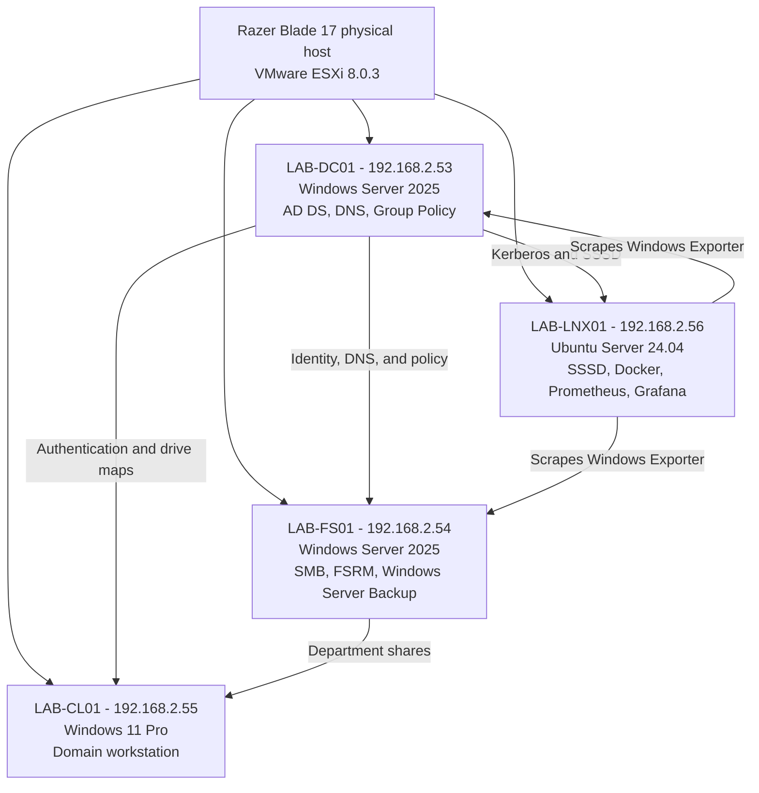

# ABELLAB Enterprise Infrastructure Lab

ABELLAB is a self-directed infrastructure project that recreates a small enterprise environment on one physical host. The project goes beyond installation screenshots: it includes deployed configuration, repeatable health checks, controlled failure tests, a verified restore drill, and an incident record describing a failed backup attempt and its resolution.

> This is an isolated home lab. It contains synthetic identities, RFC 1918 addresses, evaluation software, and no patient data, PHI, employer systems, or production workloads.

## What this repository proves

- Windows Server administration with Active Directory Domain Services, DNS, Group Policy, SMB, NTFS, FSRM, and Windows Server Backup.
- Least-privilege authorization through global-to-domain-local group nesting and access-based enumeration.
- Windows and Linux domain membership using Kerberos, SSSD, realmd, and group-based sudo delegation.
- VMware ESXi virtual-machine administration on a resource-constrained single host.
- Containerized Prometheus and Grafana monitoring for Windows and Linux systems.
- Operational validation through executable scripts, not claims alone.
- Troubleshooting discipline through a documented backup-target conflict, corrective action, and integrity-checked recovery.

## Architecture



See [docs/ARCHITECTURE.md](docs/ARCHITECTURE.md) for roles, trust boundaries, and service flows.

## Deployed controls

| Area | Implementation | Verified outcome |
|---|---|---|
| Identity | AD forest `corp.abel-lab.test`, structured OUs, synthetic users, AGDLP-style groups | Windows and Linux resolve the same identities and nested memberships |
| Client policy | Security-filtered Group Policy drive maps | Users receive only their department drive |
| File access | SMB + NTFS permissions, access-based enumeration | Authorized writes succeed; other departments remain denied |
| File governance | 25 GB FSRM hard quotas and executable file screens | Documents are allowed while executable types are blocked |
| Recovery | Daily Windows Server Backup with system state and bare-metal recovery | Deleted test file restored to an alternate path with matching SHA-256 hash |
| Linux access | realmd, SSSD, Kerberos, PAM home creation, AD group-based sudo | Authorized AD administrator can sign in and elevate |
| Monitoring | Docker Compose, Prometheus, Grafana, Node Exporter, Windows Exporter | Windows and Linux telemetry visible from one monitoring server |
| Alerting | `ExporterDown` rule with a one-minute hold | Controlled outage progressed through pending, firing, and recovered states |

## Proof model

The repository has four complementary forms of evidence:

1. **Configuration:** the Compose stack, Prometheus scrape configuration, alert rule, and Grafana datasource are the same definitions used by the lab.
2. **Automation:** validation scripts test directory health, authorization, FSRM enforcement, Linux trust, monitoring health, and recovery integrity.
3. **Operational evidence:** screenshots show the scripts and dashboards reporting live results.
4. **Troubleshooting record:** [INC-001](docs/incidents/INC-001-backup-target-mode-conflict.md) records a failed recovery-drill backup, impact assessment, safe correction, and preventive lesson.

See [docs/VALIDATION.md](docs/VALIDATION.md) for the test matrix and [evidence/README.md](evidence/README.md) for the evidence catalog.

## Repository map

```text
configs/monitoring/       Deployed Docker, Prometheus, and Grafana definitions
provisioning/             Sanitized, parameterized versions of the build procedures
scripts/windows/          Repeatable Windows validation scripts
scripts/linux/            Repeatable Linux and AD integration validation
tests/                    Local static-validation entry points
docs/                     Architecture, decisions, validation, and incident records
evidence/screenshots/     Selected outputs captured from the live lab
.github/workflows/        Syntax and configuration validation for every change
```

## Reproduce the monitoring configuration

On an Ubuntu host with Docker Engine and the Compose plugin:

```bash
cd configs/monitoring
docker compose config
docker compose up -d
docker compose ps
```

The published ports intentionally bind to the lab monitoring address (`192.168.2.56`) rather than every interface. Change that address for a different environment. Do not expose Grafana, Prometheus, ESXi, RDP, or SSH directly to the public internet.

## Run the static checks

From PowerShell:

```powershell
pwsh -NoProfile -File tests/Test-PowerShellSyntax.ps1
```

From Linux or WSL with Docker available:

```bash
bash tests/validate.sh
```

The GitHub Actions workflow repeats PowerShell parsing, Bash parsing, Docker Compose rendering, and Prometheus configuration/rule validation.

## Important limitations

- ESXi runs on unsupported consumer laptop hardware. The CPU-uniformity workaround and injected Realtek driver are lab accommodations, not production recommendations.
- This is a single-host lab without vCenter, shared storage, clustering, HA, or redundant domain controllers.
- Windows Server and ESXi evaluation/licensing constraints apply.
- Screenshots demonstrate a point in time; scripts and configuration are included so the claims remain inspectable and repeatable.

## Why there is no public demo login

Infrastructure administration is not safely demonstrated by publishing RDP, SSH, ESXi, Prometheus, or Grafana credentials. The public proof is the configuration, validation code, test output, and controlled evidence in this repository. A live walkthrough can be performed locally during an interview without exposing the management plane.
