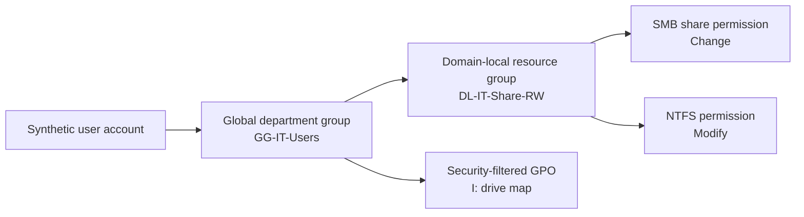
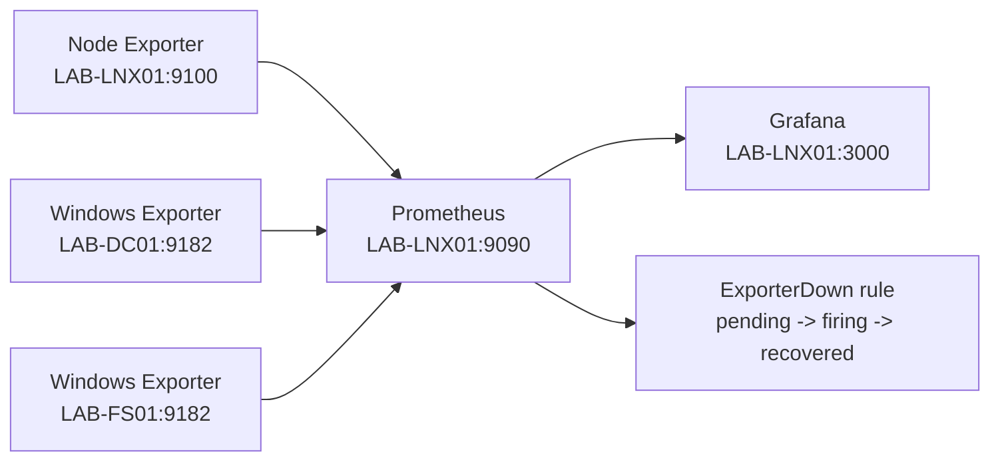

# Architecture

## System inventory

| System | Address | Operating system | Resources | Role |
|---|---:|---|---|---|
| ESXi host | `192.168.2.50` | VMware ESXi 8.0.3 | Single-host lab, 32 GB RAM | Type-1 hypervisor and local datastore |
| LAB-DC01 | `192.168.2.53` | Windows Server 2025 Standard Evaluation | 2 vCPU, 6 GB RAM | AD DS, DNS, Group Policy |
| LAB-FS01 | `192.168.2.54` | Windows Server 2025 Standard Evaluation | 2 vCPU, 4 GB RAM | SMB, NTFS, ABE, FSRM, backup |
| LAB-CL01 | `192.168.2.55` | Windows 11 Pro | 2 vCPU, 4 GB RAM | Domain workstation and end-user validation |
| LAB-LNX01 | `192.168.2.56` | Ubuntu Server 24.04.4 LTS | 2 vCPU, 4 GB RAM | AD member, Docker, Prometheus, Grafana |

All addresses are private RFC 1918 lab addresses. DHCP reservations are maintained on the SXR80 router; servers use stable addressing and AD-aware DNS configuration.

## Identity and authorization flow

This follows the practical AGDLP pattern: accounts belong to global role groups; global groups are nested into domain-local resource groups; resource permissions are assigned to domain-local groups. The design separates employment/department identity from access to a particular resource.

## Name resolution and trust

- `LAB-DC01` hosts the `corp.abel-lab.test` AD-integrated DNS zone.
- Windows members use `192.168.2.53` as DNS and maintain machine-account secure channels with the domain.
- `LAB-LNX01` resolves the AD DNS namespace, joins the Kerberos realm, and resolves identities through SSSD.
- Linux login and sudo authorization depend on AD group membership; Linux is a domain member, not a tunnel through a Windows system.

## File-service boundary

`LAB-FS01` separates the file-server role from the domain controller. Department folders live on a dedicated data volume and are published as distinct shares. The same domain-local group is applied at both the share and NTFS layers. Access-based enumeration hides shares a user cannot access.

FSRM adds governance controls:

- 25 GB hard quota per departmental share.
- Active executable file screens for HR, Finance, and Clinical shares.
- Test scripts verify both allowed business documents and denied executable types.

## Backup boundary

`LAB-FS01` uses a dedicated backup volume and a daily Windows Server Backup policy at 02:00. The policy includes critical volumes, system state, and bare-metal recovery. Recovery evidence uses a deliberately created file in an isolated test path, deletes only that file after safety checks, restores it to an alternate directory, and compares SHA-256 hashes.

## Monitoring flow

Prometheus and Grafana bind to the monitoring host's LAN address. Windows Firewall limits TCP 9182 access to the monitoring server. Administrative services remain local to the trusted network.

## Production gaps

The lab intentionally prioritizes breadth and hands-on practice over production redundancy. It does not include a second domain controller, vCenter, shared storage, high availability, enterprise backup media, off-site replication, centralized log retention, or a secrets platform. Those are documented gaps, not implied capabilities.
