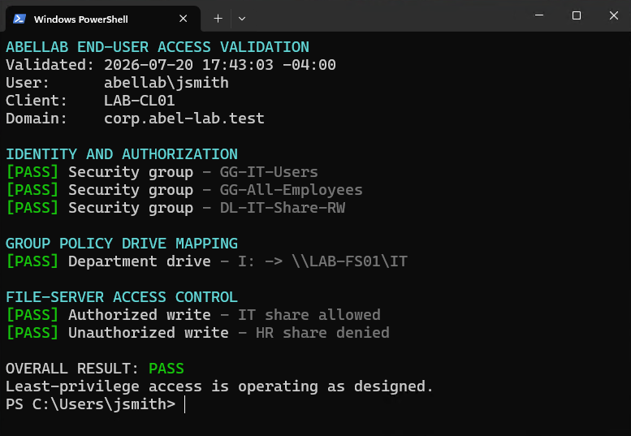
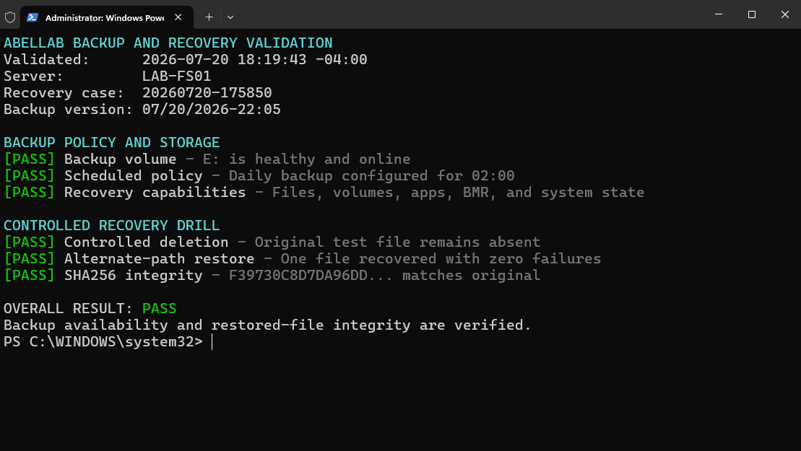

# Evidence catalog

These images were captured from the live, isolated ABELLAB environment on July 20, 2026. The identities are synthetic and the addresses are private RFC 1918 lab addresses.

| ID | Evidence | What it demonstrates |
|---|---|---|
| 01 | [Least-privilege validation](screenshots/Evidence-01-Least-Privilege-Validation.png) | Domain identity, nested groups, GPO drive mapping, authorized IT write, denied HR write |
| 02 | [FSRM security enforcement](screenshots/Evidence-02-FSRM-Security-Enforcement.png) | HR authorization, mapped drive, allowed document, blocked executable, denied Finance write |
| 03 | [Cross-platform identity and monitoring](screenshots/Evidence-03-Cross-Platform-Identity-Monitoring.png) | Linux machine trust, SSSD, AD identity/group resolution, delegated sudo, Docker and monitoring health |
| 04 | [Domain-services health](screenshots/Evidence-04-Domain-Services-Health.png) | AD core services, SYSVOL/NETLOGON, secure DNS, LDAP discovery, focused DCDIAG |
| 05 | [Backup and recovery integrity](screenshots/Evidence-05-Backup-Recovery-Integrity.png) | Healthy backup target, scheduled policy, alternate-path restore, matching SHA-256 hash |
| 06 | [Windows monitoring dashboard](screenshots/Evidence-06-Windows-Server-Monitoring-Dashboard.png) | Live DC and file-server CPU, memory, disk, network, uptime, and process telemetry |
| 07 | [Linux monitoring dashboard](screenshots/Evidence-07-Linux-Monitoring-Dashboard.png) | Live Linux CPU, memory, filesystem, network, process, and uptime telemetry |
| 08A | [Alert pending](screenshots/Evidence-08A-Alert-Pending.png) | Controlled exporter outage entered the pending state |
| 08B | [Alert firing](screenshots/Evidence-08B-Alert-Firing.png) | Outage exceeded the configured one-minute hold period |
| 08C | [Alert recovered](screenshots/Evidence-08C-Alert-Recovered.png) | Rule returned to inactive after exporter recovery |

## Representative validation output

## Evidence limitations

Screenshots can show results but cannot independently prove how those results were produced. The corresponding configuration and validation scripts are included in the repository so reviewers can inspect the controls and rerun them in a compatible environment.
